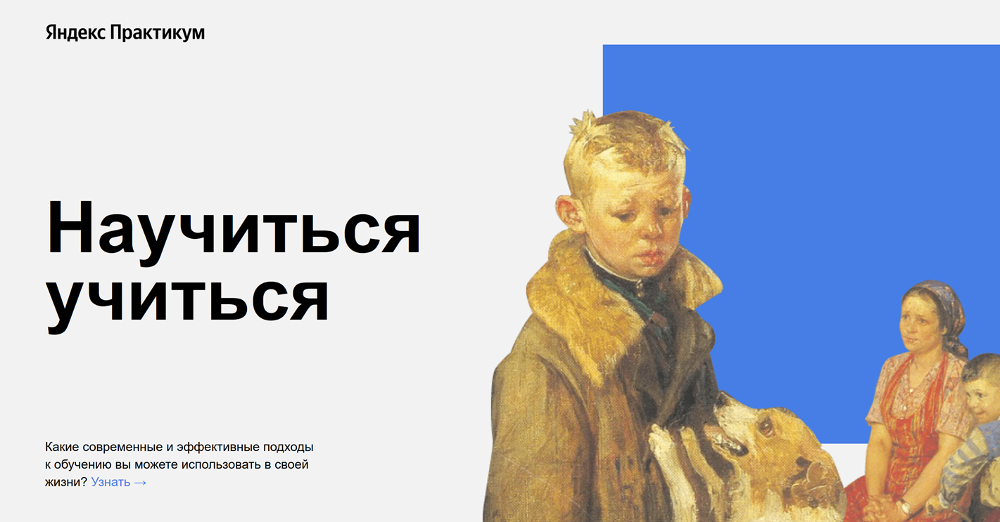
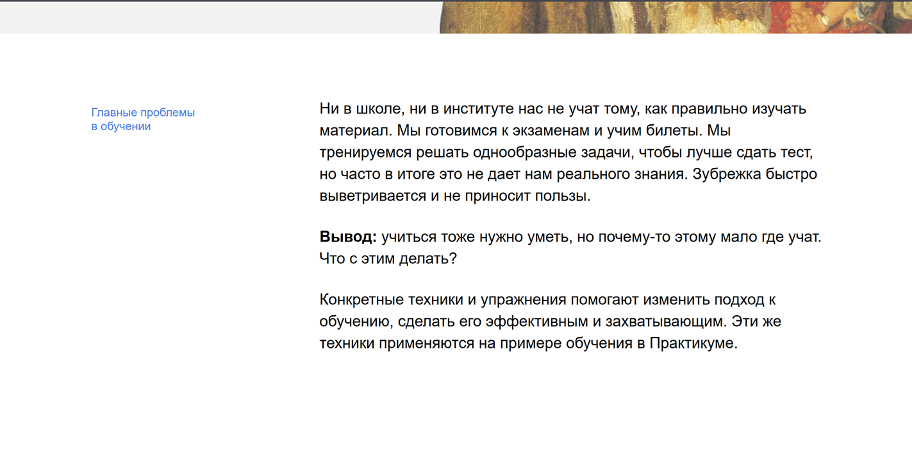
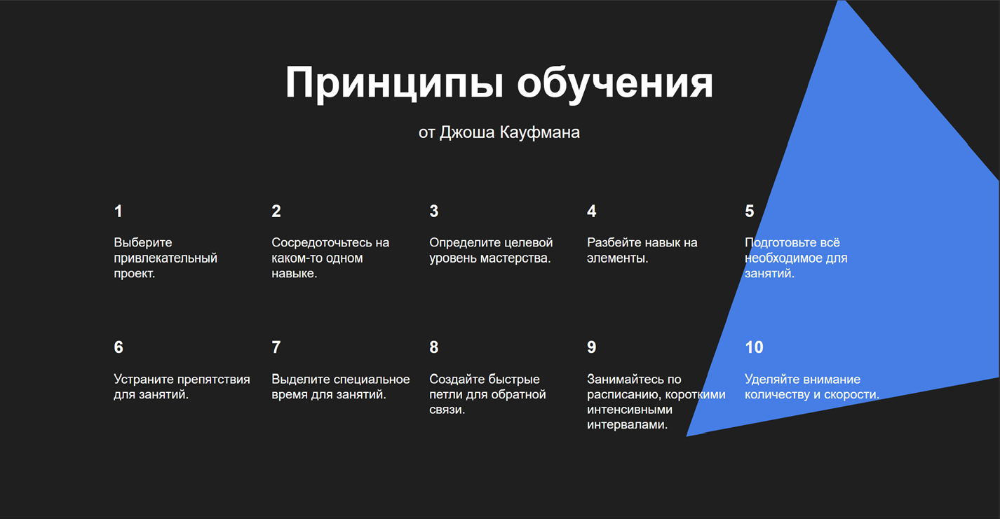
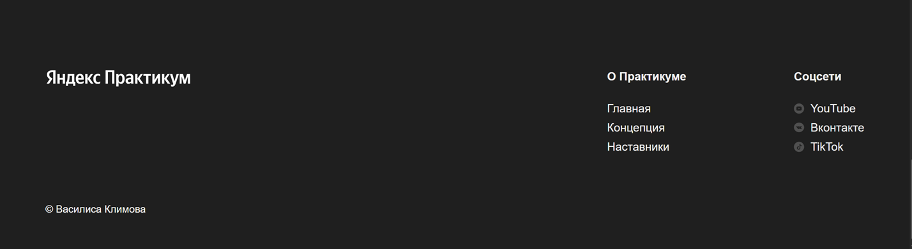

# Научиться учиться — учебный проект

## 📌 Описание

Этот проект создан в рамках обучения веб-разработке.  
Он представляет собой лендинг о современных подходах к обучению, с информацией, иллюстрациями и ссылками на ресурсы.

Сайт сверстан с использованием **HTML** и **CSS**, с упором на семантику, методологию **БЭМ**, и адаптацию под различные разрешения экранов (в перспективе — через медиазапросы).

## 🚀 Технологии

- HTML5
- CSS3
- Flexbox
- БЭМ (Блок-Элемент-Модификатор)
- Git

## 📁 Структура проекта

📦 project-folder
┣ 📂 images
┣ 📂 styles
┃ ┣ 📄 normalize.css
┃ ┗ 📄 style.css
┣ 📄 index.html
┗ 📄 README.md


## 📷 Превью








## 🔧 Как запустить

1. Склонируйте репозиторий:
   ```bash
   git clone https://github.com/ваш-логин/название-репозитория.git

2. Откройте файл index.html в браузере.
